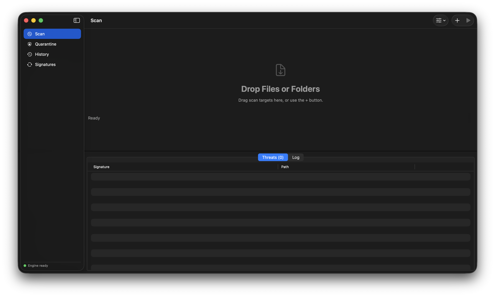

# ClamGUI

 

Native SwiftUI front-end for ClamAV on macOS. Wraps `clamscan` / `clamdscan` / `freshclam` as child processes with streaming output parsing — no libclamav FFI, so it tracks whatever engine version Homebrew ships.



## Requirements

- macOS 14 (Sonoma) or later — uses `NavigationSplitView`, `ContentUnavailableView`, `Table` context menus, and the new `onChange` signature
- Xcode 15+
- ClamAV installed: `brew install clamav`, then configure `$(brew --prefix)/etc/clamav/freshclam.conf` (comment out the `Example` line) and run `freshclam` once

## Build

Option A — XcodeGen (recommended):

```sh
brew install xcodegen
cd ClamGUI
xcodegen generate
open ClamGUI.xcodeproj
```

`project.yml` is the source of truth for project configuration. The checked-in `ClamGUI.xcodeproj` is committed for convenience but should be regenerated after any change to `project.yml`.

Option B — manual: create a new macOS App target in Xcode (SwiftUI lifecycle), drop in everything under `Sources/`, **disable App Sandbox** in Signing & Capabilities, keep Hardened Runtime on.

> Sandbox is off by design: the app spawns Homebrew binaries via `Process` and needs unrestricted read access to scan arbitrary paths. If you distribute outside your own machine, sign with Developer ID and notarize as usual; nothing here blocks notarization.

For scanning protected locations (`~/Mail`, `~/Library`, TCC-guarded dirs), grant the built app **Full Disk Access** in System Settings → Privacy & Security.

## Optional: clamd daemon mode

For multi-threaded scanning via `clamdscan --fdpass --multiscan` (signatures stay
resident in memory — much faster for repeated scans):

```sh
PREFIX="$(brew --prefix)"

# 1. Signatures must exist before clamd will start
freshclam

# 2. Create clamd.conf from the sample. Two edits are required, not one:
#    the sample ships fully commented out, and clamd refuses to start without
#    a server socket defined ("Please define server type (local and/or TCP)").
cp "$PREFIX/etc/clamav/clamd.conf.sample" "$PREFIX/etc/clamav/clamd.conf"
sed -i ''   -e 's/^Example/#Example/'   -e 's|^#LocalSocket /tmp/clamd.socket|LocalSocket /tmp/clamd.socket|'   "$PREFIX/etc/clamav/clamd.conf"

# 3. Run it — foreground for a first smoke test:
clamd --foreground
# ...or as a launchd service for real use:
brew services start clamav

# 4. Verify the daemon answers:
clamdscan --ping 1 && echo "clamd up"
```

`clamdscan` reads the same `clamd.conf` to locate the socket, so no app-side
socket configuration is needed. ClamGUI probes with `clamdscan --ping 1` at
launch and after **Settings → Engine → Re-detect Toolchain**; once the daemon
answers, the "Use clamd" toggle enables. Two things to remember in daemon mode:
scan limits (max file size, recursion, etc.) come from `clamd.conf`, not the
app's Limits tab, and after a `freshclam` run the daemon needs `RELOAD` —
`brew services restart clamav` or wait for its `SelfCheck` interval.

## Xcode 26 / macOS Tahoe notes

The project pins its language mode explicitly, so Xcode 26's new-template
defaults (Swift 6 mode, default-MainActor isolation, approachable concurrency)
don't apply — XcodeGen-generated projects use exactly what `project.yml` says:

- `SWIFT_VERSION = 5.0` (language mode) with `SWIFT_STRICT_CONCURRENCY = complete`.
  This builds warning-clean intent on Xcode 15 through 26.
- The code is written to be Swift 6-clean: non-Sendable `FileHandle`s are
  transferred into their single reader task via a documented `UncheckedSendable`
  box, `Process` state is extracted synchronously inside termination handlers
  before any actor hop, the stream-reading loop is `nonisolated`, and child
  cleanup uses a lock-based registry rather than actors (MainActor tasks aren't
  guaranteed to run during app teardown).
- To opt into Swift 6 mode (checks become errors): set `SWIFT_VERSION: "6.0"`
  in `project.yml` and regenerate. Do not use `SWIFT_STRICT_CONCURRENCY =
  minimal` to silence warnings — it hides real data races instead of fixing them.

## Architecture

```
AppState (ObservableObject, @main-owned)
├── ClamAVLocator         binary discovery: user override → /opt/homebrew → /usr/local → /opt/local
├── ScanEngine            Process + Pipe, AsyncSequence line streaming (FileHandle.bytes.lines),
│                         regex parse of "<path>: <Sig> FOUND", summary block parsing,
│                         exit-code semantics (0 clean / 1 infected / 2 error),
│                         drain-before-finalize, ~8 Hz batched UI publishing
├── QuarantineManager     move-to-vault, 0o400 blobs, streamed SHA-256 (constant memory),
│                         cross-volume copy verification, restore-collision protection,
│                         index reconciliation on launch
├── FreshclamManager      on-demand freshclam; detects unconfigured Example line and
│                         concurrent-instance DB lock contention
├── HistoryStore          SQLite (WAL, libsqlite3 system lib, zero deps): scans + threats
│                         tables, FK cascade, 1000-record retention, aggregate stats;
│                         degrades to in-memory if the DB can't open
├── ProfileStore          named ScanOptions sets (Default/Quick/Deep built-in),
│                         JSON import/export, name de-duplication
├── NotificationManager   UNUserNotificationCenter, lazy auth, respects denial
└── ChildProcessRegistry  lock-based (not actor-based) registry so children are
                          SIGTERMed synchronously in NSApplication.willTerminate
```

## Reliability engineering

Things done specifically so this behaves under stress rather than just in demos:

- **No lost detections.** The Process termination handler awaits both pipe readers
  reaching EOF before finalizing state, so detections written in the child's last
  flush are never dropped (a classic race in terminationHandler-based wrappers).
- **Main-thread protection.** Per-line `@Published` mutations would fire hundreds of
  SwiftUI invalidations per second on a large tree; all scan output is buffered and
  flushed at ~8 Hz, and the log is ring-buffered at 5,000 lines.
- **Quarantine can't destroy evidence.** Hashing is streamed (1 MiB chunks — a 50 GB
  disk image won't OOM the app), and cross-volume quarantine verifies the copy's
  SHA-256 before unlinking the original. Restore refuses to overwrite an existing
  file at the original path. Orphaned index entries are reconciled at launch.
- **No orphaned children.** Every spawned clamscan/freshclam is registered in a
  lock-based registry and terminated in `willTerminate` — deliberately not
  actor-based, because MainActor tasks aren't guaranteed to run during teardown.
- **Graceful degradation.** If the history DB can't open, the app runs with
  session-only history and says so in the UI instead of crashing. If clamd isn't
  reachable, the daemon toggle is disabled with an explanation. freshclam lock
  contention (a scheduled update running concurrently) gets a specific message.
- **Cancellation is a first-class state** (`ScanState.cancelled`), not an exit-code
  misread — SIGTERM'd scans aren't recorded as "engine error".

Design decisions worth knowing:

- **clamd toggle.** When clamd is reachable (`clamdscan --ping 1`), Settings → Engine lets you switch to `clamdscan --fdpass --multiscan`. `--fdpass` passes file descriptors over the local socket so clamd never needs read permission on your files; `--multiscan` fans out across the daemon thread pool. Scan limits then come from `clamd.conf`, not the app — the UI notes this.
- **Progress.** `clamscan --verbose` emits `Scanning <path>` per file; the engine counts these for the live file counter and current-path display but keeps them out of the log to avoid 100k-line logs on home-directory scans. Log is ring-buffered at 5,000 lines.
- **Detection parsing** anchors on the `" FOUND"` suffix (`^(.*): (\S+) FOUND$`) because paths can legally contain `": "`.
- **Quarantine** is move-based (atomic on same volume, copy+unlink across volumes), stores the original path, signature, size, timestamp, and SHA-256 for later IOC correlation, and the vault directory is `0o700`.

## Features beyond v1

- **Scan history** — every scan recorded to SQLite with per-threat detail, drill-down
  UI, aggregate stats (total scans/threats/files, last scan), 1000-record retention.
- **Scan profiles** — named option sets with Default/Quick/Deep built-ins, save-current-as,
  JSON import/export for distribution across machines, "Custom" detachment when live
  options diverge from the active profile. Profile name is recorded in history.
- **Menu bar extra** — shield state glyph (idle/scanning/threats), live progress,
  stop scan, trigger signature updates, toggleable in Settings.
- **Notifications** — scan complete / threats found / engine error via
  UserNotifications, with lazy permission request.

## Known limitations / next steps

- No scheduled scans — pair with a `launchd` plist calling `clamscan` directly, or add `SMAppService` registration.
- No on-access scanning; ClamAV's `clamonacc` is Linux-only (fanotify). Real-time protection on macOS would require an Endpoint Security system extension — a substantially bigger project.
- freshclam via this GUI inherits the invoking user's permissions; if your DB dir is root-owned (some MacPorts setups), run updates out-of-band.
- Quarantined files are moved but not encrypted/encoded; some other AV products XOR-armor quarantine blobs so a second scanner doesn't re-flag them. Easy to add if your endpoint runs multiple engines.
- VirusTotal hash lookup not yet wired — the SHA-256 is already computed and copyable from Quarantine.

## License

ClamGUI is licensed under the **GNU General Public License v3.0**. See [LICENSE](LICENSE) for the full text.

ClamAV itself is licensed under GPL-2.0 and is *not* bundled with this app — ClamGUI invokes the binaries that you install separately (typically via Homebrew). The two programs communicate only as parent/child processes; no libclamav code is linked.

## Contributing

Issues and pull requests are welcome. For non-trivial changes, please open an issue first to discuss the approach — much of this code is structured around specific reliability invariants (no-lost-detections, drain-before-finalize, lock-based child registry, streamed hashing) and PR descriptions should explain which invariant the change preserves or modifies.
